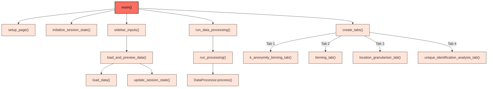
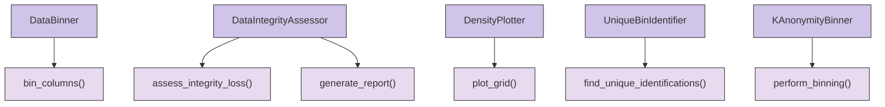
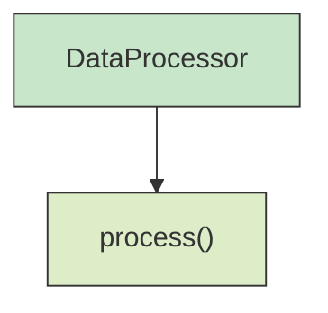
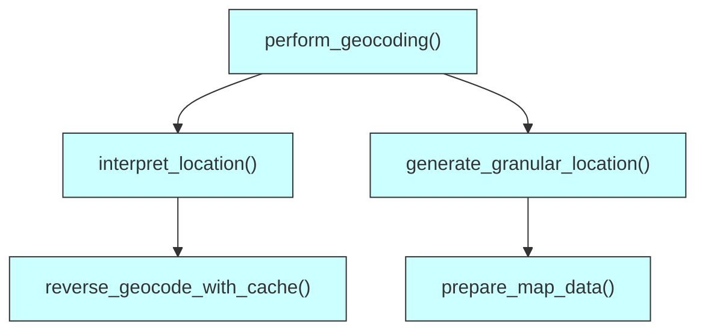
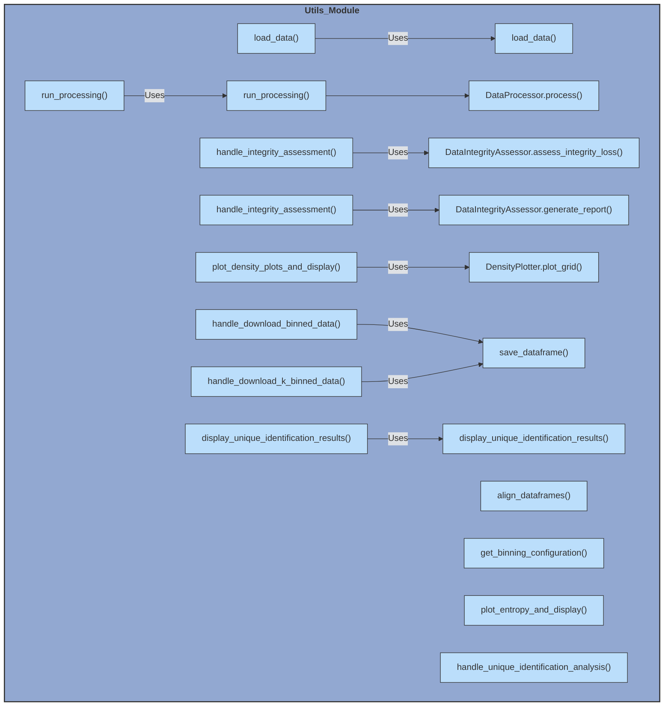

# Detailed Overview of the De-Identification Tool Application

## Table of Contents

- [Detailed Overview of the De-Identification Tool Application](#detailed-overview-of-the-de-identification-tool-application)
  - [Table of Contents](#table-of-contents)
  - [Introduction](#introduction)
  - [Codebase Structure](#codebase-structure)
    - [Key Directories and Files:](#key-directories-and-files)
  - [Application Pipelines](#application-pipelines)
    - [Main Application Module (Application.py)](#main-application-module-applicationpy)
    - [Data Flows](#data-flows)
    - [Binning Module (src.binning)](#binning-module-srcbinning)
    - [Data Processing Module (src.data\_processing)](#data-processing-module-srcdata_processing)
    - [Location Granularizer Module (src.location\_granularizer)](#location-granularizer-module-srclocation_granularizer)
    - [Utils Module (src.utils)](#utils-module-srcutils)
    - [Data Types](#data-types)
  - [Module Breakdown](#module-breakdown)
    - [1. Application.py](#1-applicationpy)
    - [2. Configuration Module (`config.py`)](#2-configuration-module-configpy)
    - [3. Binning Module (`src.binning`)](#3-binning-module-srcbinning)
      - [`data_binner.py`](#data_binnerpy)
      - [`k_anonymity_binner.py`](#k_anonymity_binnerpy)
      - [`data_integrity_assessor.py`](#data_integrity_assessorpy)
      - [`density_plotter.py`](#density_plotterpy)
      - [`unique_bin_identifier.py`](#unique_bin_identifierpy)
      - [`__init__.py`](#__init__py)
    - [4. Data Processing Module (`src.data_processing`)](#4-data-processing-module-srcdata_processing)
      - [`Detect_Dtypes.py`](#detect_dtypespy)
      - [`Process_Data.py`](#process_datapy)
      - [`__init__.py`](#__init__py-1)
    - [5. Location Granularizer Module (`src.location_granularizer`)](#5-location-granularizer-module-srclocation_granularizer)
      - [`geocoding.py`](#geocodingpy)
      - [`__init__.py`](#__init__py-2)
    - [6. Utilities Module (`src.utils`)](#6-utilities-module-srcutils)
      - [`utils.py`](#utilspy)
      - [`__init__.py`](#__init__py-3)
  - [Application Workflow](#application-workflow)
    - [1. Data Upload and Initial Processing](#1-data-upload-and-initial-processing)
    - [2. Binning Processes](#2-binning-processes)
      - [a. Manual Binning](#a-manual-binning)
      - [b. K-Anonymity Binning](#b-k-anonymity-binning)
    - [3. K-Anonymity Binning](#3-k-anonymity-binning)
    - [4. Location Data Geocoding and Granularization](#4-location-data-geocoding-and-granularization)
    - [5. Data Integrity Assessment](#5-data-integrity-assessment)
    - [6. Density Plotting](#6-density-plotting)
    - [7. Unique Identification Analysis](#7-unique-identification-analysis)
  - [Session State Management](#session-state-management)
  - [Inter-Module Interactions](#inter-module-interactions)
    - [Binning Module (`src.binning`):](#binning-module-srcbinning-1)
    - [Data Processing Module (`src.data_processing`):](#data-processing-module-srcdata_processing-1)
    - [Location Granularizer Module (`src.location_granularizer`):](#location-granularizer-module-srclocation_granularizer-1)
    - [Utilities Module (`src.utils`):](#utilities-module-srcutils)
    - [Configuration Module (`config.py`):](#configuration-module-configpy)
  - [Caching Mechanisms](#caching-mechanisms)
  - [File and Directory Management](#file-and-directory-management)
    - [Configuration (`config.py`):](#configuration-configpy)
  - [Conclusion](#conclusion)

## Introduction

The De-Identification Tool Application is a comprehensive data processing platform designed to anonymize sensitive datasets while preserving their analytical utility. Leveraging techniques such as binning, k-anonymity, and geocoding, the application ensures that individual records within a dataset cannot be re-identified, thereby safeguarding privacy. Additionally, it provides mechanisms for assessing data integrity post-processing and offers visualization tools to understand the impact of de-identification methods.

## Codebase Structure

The application's codebase is organized systematically to promote modularity, maintainability, and scalability. Below is an overview of the repository's structure:

```scss
.
├── Application.py
├── README.md
├── __pycache__
│   ├── ... (compiled Python files)
├── data
│   ├── Data.csv
│   ├── Data.pkl
│   ├── geocache.db
│   └── outputs
│       ├── category_mappings
│       │   ├── ... (CSV mapping files)
│       ├── plots
│       │   ├── ... (Plot images)
│       ├── processed_data
│       │   ├── ... (Processed data files)
│       ├── reports
│       │   ├── ... (Report CSV files)
│       └── unique_identifications
│           └── unique_identifications.csv
├── logs
│   └── app.log
├── requirements.txt
└── src
    ├── __pycache__
    │   └── ... (compiled Python files)
    ├── binning
    │   ├── __init__.py
    │   ├── data_binner.py
    │   ├── data_integrity_assessor.py
    │   ├── density_plotter.py
    │   ├── k_anonymity_binner.py
    │   └── unique_bin_identifier.py
    ├── config.py
    ├── data_processing
    │   ├── __init__.py
    │   ├── Detect_Dtypes.py
    │   └── Process_Data.py
    ├── location_granularizer
    │   ├── __init__.py
    │   └── geocoding.py
    └── utils
        ├── __init__.py
        └── utils.py
```

### Key Directories and Files:

- **`Application.py`**: The main entry point of the application, orchestrating the user interface and workflow.
- **`src/`**: Contains all source code, further divided into submodules for specific functionalities.
    - **`binning/`**: Handles data binning and related analyses.
    - **`data_processing/`**: Manages data type detection and initial data processing.
    - **`location_granularizer/`**: Deals with geocoding and location data granularization.
    - **`utils/`**: Provides utility functions and helpers used across modules.
- **`data/`**: Stores datasets, processed outputs, reports, plots, and caches.
- **`logs/`**: Contains log files for monitoring and debugging.
- **`requirements.txt`**: Lists all Python dependencies required to run the application.

## Application Pipelines

### Main Application Module (Application.py)


### Data Flows

```mermaid
flowchart TD
    %% Define styles for clarity
    classDef functionStyle fill:#FFE0B2,stroke:#333,stroke-width:1px;
    classDef flowStyle stroke:#B565A7,stroke-width:2px,stroke-dasharray: 5 5;
    
    %% Data Flows
    subgraph Group_1
        binning_tab["binning_tab()"]:::functionStyle --> perform_binning["perform_binning()"]:::functionStyle
        perform_binning --> DataBinner.bin_columns["DataBinner.bin_columns()"]:::functionStyle
        perform_binning --> perform_integrity_assessment["perform_integrity_assessment()"]:::functionStyle
        perform_integrity_assessment --> handle_integrity_assessment_util["handle_integrity_assessment()"]:::functionStyle
        perform_binning --> plot_density_plots_and_display_util["plot_density_plots_and_display()"]:::functionStyle
    end
    
    subgraph Group_2
        k_anonymity_binning_tab["k_anonymity_binning_tab()"]:::functionStyle --> perform_k_anonymity_binning["perform_k_anonymity_binning()"]:::functionStyle
        perform_k_anonymity_binning --> KAnonymityBinner.perform_binning["KAnonymityBinner.perform_binning()"]:::functionStyle
        perform_k_anonymity_binning --> handle_download_k_binned_data_util["handle_download_k_binned_data()"]:::functionStyle
    end

    subgraph Group_3
        location_granulariser_tab["location_granulariser_tab()"]:::functionStyle --> perform_geocoding["perform_geocoding()"]:::functionStyle
        location_granulariser_tab --> perform_granular_location_generation["perform_granular_location_generation()"]:::functionStyle
        perform_granular_location_generation --> generate_granular_location["generate_granular_location()"]:::functionStyle
        location_granulariser_tab --> display_geocoded_with_granular_data["display_geocoded_with_granular_data()"]:::functionStyle
        display_geocoded_with_granular_data --> prepare_map_data["prepare_map_data()"]:::functionStyle
    end

    subgraph Group_4
        unique_identification_analysis_tab["unique_identification_analysis_tab()"]:::functionStyle --> perform_unique_identification_analysis["perform_unique_identification_analysis()"]:::functionStyle
        perform_unique_identification_analysis --> UniqueBinIdentifier.find_unique_identifications["UniqueBinIdentifier.find_unique_identifications()"]:::functionStyle
        unique_identification_analysis_tab --> display_unique_identification_results_util["display_unique_identification_results()"]:::functionStyle
    end

```



### Binning Module (src.binning)


### Data Processing Module (src.data_processing)


### Location Granularizer Module (src.location_granularizer)


### Utils Module (src.utils)



### Data Types

```mermaid
flowchart TD
    %% Define styles for clarity
    classDef functionStyle fill:#cff,stroke:#333,stroke-width:1px;

    %% Data Types
    load_data_util["load_data()"] -.->|Returns: DataFrame| load_and_preview_data["load_and_preview_data()"]:::functionStyle
    run_processing_util["run_processing()"] -.->|Returns: DataFrame| run_data_processing["run_data_processing()"]:::functionStyle
    DataProcessor.process["DataProcessor.process()"] -.->|Returns: DataFrame| run_processing_util["run_processing()"]:::functionStyle
    DataBinner.bin_columns["DataBinner.bin_columns()"] -.->|Returns: DataFrame & Dict| perform_binning["perform_binning()"]:::functionStyle
    KAnonymityBinner.perform_binning["KAnonymityBinner.perform_binning()"] -.->|Returns: DataFrame| perform_k_anonymity_binning["perform_k_anonymity_binning()"]:::functionStyle
    UniqueBinIdentifier.find_unique_identifications["UniqueBinIdentifier.find_unique_identifications()"] -.->|Returns: DataFrame| perform_unique_identification_analysis["perform_unique_identification_analysis()"]:::functionStyle
    generate_granular_location["generate_granular_location()"] -.->|Returns: DataFrame| perform_granular_location_generation["perform_granular_location_generation()"]:::functionStyle
    prepare_map_data["prepare_map_data()"] -.->|Returns: DataFrame| display_geocoded_with_granular_data["display_geocoded_with_granular_data()"]:::functionStyle
    find_unique_identifications["find_unique_identifications()"] -.->|Returns: DataFrame| perform_unique_identification_analysis["perform_unique_identification_analysis()"]:::functionStyle
```




## Module Breakdown

### 1. Application.py

**Location**: Root directory

**Purpose**: Serves as the main application module, setting up the Streamlit user interface, managing user interactions, and coordinating various processing tasks through different tabs.

**Key Components:**

- **Imports**: Integrates modules from `src.binning`, `src.utils`, `src.config`, and `src.location_granularizer`.
- **Session State Management**: Initializes and updates session state variables to maintain state across user interactions.
- **Page Configuration**: Sets up Streamlit page settings and custom styles.
- **Sidebar Inputs**: Renders the sidebar for file uploads, settings, binning options, and displays session state information.
- **Data Loading and Saving**: Handles the loading of uploaded datasets and saving of raw and processed data.
- **Tabs**: Implements four main tabs:
    - 🔒 K-Anonymity Binning
    - 📊 Manual Binning
    - 📍 Location Data Geocoding Granulariser
    - 🔍 Unique Identification Analysis
- **Main Function**: Orchestrates the overall workflow, invoking appropriate functions based on user inputs and tab selections.

### 2. Configuration Module (`config.py`)

**Location**: `src/config.py`

**Purpose**: Centralizes path configurations and directory management, ensuring consistency across the application.

**Key Components:**

- **Directory Paths**: Defines base directories (`BASE_DIR`, `DATA_DIR`, `LOGS_DIR`) and subdirectories for processed data, reports, plots, unique identifications, and category mappings.
- **Directory Initialization**: Ensures that all necessary directories exist, creating them if they don't.

### 3. Binning Module (`src.binning`)

**Location**: `src/binning/`

**Purpose**: Manages data binning operations, assessing data integrity post-binning, plotting density distributions, and conducting unique identification analyses.

**Submodules and Their Roles:**

#### `data_binner.py`

**Class `DataBinner`**: Bins specified columns based on methods like 'equal width' or 'quantile'.

**Functions:**

- `bin_columns`: Performs binning on selected columns.
- `_bin_column`: Helper function to bin individual columns.
- `get_binned_data`, `get_binned_columns`: Retrieve binned data and column categorizations.

#### `k_anonymity_binner.py`

**Class `KAnonymityBinner`**: Implements k-anonymity binning to ensure that each combination of binned columns appears at least k times.

**Functions:**

- `perform_binning`: Executes the k-anonymity binning process.
- `_get_initial_bins`, `_apply_binning`, `_check_k_anonymity`, `_adjust_bins`: Helper functions to manage bin configurations and verify k-anonymity.

#### `data_integrity_assessor.py`

**Class `DataIntegrityAssessor`**: Assesses the loss of data integrity post-binning by comparing entropy levels.

**Functions:**

- `assess_integrity_loss`: Computes entropy loss for each column.
- `generate_report`, `save_report`, `plot_entropy`, `get_overall_loss`: Generate and manage integrity reports and visualizations.

#### `density_plotter.py`

**Class `DensityPlotter`**: Generates density plots for selected columns to visualize data distributions before and after binning.

**Functions:**

- `plot_grid`: Creates a grid of density plots.

#### `unique_bin_identifier.py`

**Class `UniqueBinIdentifier`**: Identifies unique observations based on combinations of binned columns.

**Functions:**

- `find_unique_identifications`: Analyzes combinations to determine unique identifications.
- `get_results`, `save_results`, `plot_results`: Manage results and visualizations.

#### `__init__.py`

**Exports**: Makes classes like `DataBinner`, `KAnonymityBinner`, `DataIntegrityAssessor`, `DensityPlotter`, and `UniqueBinIdentifier` accessible when importing `src.binning`.

### 4. Data Processing Module (`src.data_processing`)

**Location**: `src/data_processing/`

**Purpose**: Handles initial data processing tasks, including data type detection and type conversions to prepare the dataset for binning.

**Submodules and Their Roles:**

#### `Detect_Dtypes.py`

**Class `DtypeDetector`**: Detects and converts column data types based on specified thresholds and configurations.

**Functions:**

- `process_dataframe`: Processes the DataFrame to determine and convert data types.
- `_detect_dtype`, `_convert_dtype`: Helper functions for data type operations.
- `get_category_mapping`: Retrieves mappings for categorical variables.

#### `Process_Data.py`

**Class `DataProcessor`**: Orchestrates the data processing workflow, utilizing `DtypeDetector` to process and save data.

**Functions:**

- `process`: Executes the processing steps, including reading data, type conversion, and saving processed data.
- `save_category_mappings`: Saves category mappings for categorical columns.

#### `__init__.py`

**Exports**: Makes classes like `DtypeDetector` and `DataProcessor` accessible when importing `src.data_processing`.

### 5. Location Granularizer Module (`src.location_granularizer`)

**Location**: `src/location_granularizer/`

**Purpose**: Processes location-based data by extracting geographical entities, performing geocoding, and generating granular location information (e.g., city, state, continent).

**Submodules and Their Roles:**

#### `geocoding.py`

**Functions:**

- `detect_geographical_columns`: Identifies columns likely containing geographical data.
- `extract_gpe_entities`: Uses spaCy to extract geopolitical entities from text.
- `interpret_location`, `geocode_location`, `geocode_location_with_cache`: Perform geocoding with caching mechanisms to optimize performance.
- `perform_geocoding`: Applies geocoding to selected columns with progress tracking.
- `reverse_geocode_with_cache`: Retrieves granular location information (e.g., city, state) from latitude and longitude.
- `generate_granular_location`: Generates new columns with granular location data based on specified granularity levels.
- `prepare_map_data`: Prepares geocoded data for mapping visualizations.
- `close_cache_connection`: Ensures that the geocoding cache is properly closed upon application exit.

#### `__init__.py`

**Exports**: Makes functions like `extract_gpe_entities`, `interpret_location`, `geocode_location_with_cache`, `detect_geographical_columns`, `reverse_geocode_with_cache`, `perform_geocoding`, `generate_granular_location`, and `prepare_map_data` accessible when importing `src.location_granularizer`.

### 6. Utilities Module (`src.utils`)

**Location**: `src/utils/`

**Purpose**: Provides a suite of utility functions that support various operations across the application, such as data loading, saving, plotting, and handling downloads.

**Submodules and Their Roles:**

#### `utils.py`

**Functions:**

- `hide_streamlit_style`: Applies custom CSS to hide Streamlit's default menu and footer for a cleaner interface.
- `run_processing`: Initializes and executes the data processing workflow using `DataProcessor`.
- `load_data`: Handles the uploading and loading of datasets into Pandas DataFrames.
- `align_dataframes`: Ensures that original and binned DataFrames have consistent columns.
- `save_dataframe`: Saves DataFrames to specified file types and directories.
- `load_dataframe`: Loads DataFrames from specified file types and paths.
- `get_binning_configuration`: Generates UI sliders for configuring bin counts on selected columns.
- `plot_entropy_and_display`: Plots entropy assessments and displays them within Streamlit.
- `plot_density_plots_and_display`: Generates and displays density plots for original and binned data.
- `handle_download_binned_data`: Manages the download functionality for binned data.
- `handle_download_k_binned_data`: Manages the download functionality for k-anonymity binned data.
- `handle_integrity_assessment`: Conducts data integrity assessments and manages related outputs.
- `handle_unique_identification_analysis`: Performs unique identification analysis and manages related outputs.
- `display_unique_identification_results`: Displays the results of unique identification analyses and facilitates downloads.

#### `__init__.py`

**Exports**: Makes all utility functions accessible when importing `src.utils`.

## Application Workflow

The application follows a structured workflow, segmented into distinct phases corresponding to its main functionalities. Here's an in-depth look at each phase:

### 1. Data Upload and Initial Processing

**Process:**

- **File Upload**: Users upload their dataset via the sidebar, supporting CSV and Pickle (`.pkl`) formats.
- **Data Loading**: The `load_data` function reads the uploaded file into a Pandas DataFrame.
- **Data Preview**: A preview of the original data is displayed to the user.
- **Data Saving**: The raw data is saved in the `data/` directory in the chosen format.
- **Data Processing**: The `run_processing` function initializes `DataProcessor`, which uses `DtypeDetector` to detect and convert data types based on predefined thresholds and configurations. The processed data is saved in the `processed_data/` subdirectory.

**Key Functions:**

- `sidebar_inputs()`
- `load_and_preview_data()`
- `load_data()`
- `run_processing()`
- `DataProcessor.process()`

### 2. Binning Processes

The application offers two binning approaches: **Manual Binning** and **K-Anonymity Binning**.

#### a. Manual Binning

**Process:**

- **Column Selection**: Users select numerical or datetime columns to bin, excluding those used for location granularization.
- **Binning Configuration**: Users specify the number of bins for each selected column via sliders.
- **Binning Execution**: The `DataBinner` class bins the data based on the chosen method (`Quantile` or `Equal Width`).
- **Data Integrity Assessment**: Post-binning, `DataIntegrityAssessor` evaluates the loss in data integrity by comparing entropy before and after binning.
- **Visualization**: `DensityPlotter` generates density plots to visualize data distributions.
- **Data Saving and Downloading**: Binned data is incorporated into the global dataset and made available for download.

**Key Functions:**

- `binning_tab()`
- `perform_binning()`
- `DataBinner.bin_columns()`
- `perform_integrity_assessment()`
- `DataIntegrityAssessor.assess_integrity_loss()`
- `plot_density_plots_and_display()`
- `handle_download_binned_data()`

#### b. K-Anonymity Binning

**Process:**

- **Column Selection**: Users select columns for k-anonymity binning.
- **K Value Specification**: Users set the desired k value to define anonymity levels.
- **Binning Execution**: `KAnonymityBinner` automates binning to ensure that each combination of binned columns appears at least k times.
- **Data Integration and Download**: The k-anonymity binned data is integrated into the global dataset and made available for download.

**Key Functions:**

- `k_anonymity_binning_tab()`
- `perform_k_anonymity_binning()`
- `KAnonymityBinner.perform_binning()`
- `handle_download_k_binned_data()`

### 3. K-Anonymity Binning

**Detailed Steps:**

- **Column Selection**: Users select one or more columns for k-anonymity binning.
- **K Value Input**: Users input the desired level of anonymity (k), defaulting to 5.
- **Binning Execution**:
    - `KAnonymityBinner` reduces the number of bins iteratively until each combination of binned columns meets the k-anonymity requirement.
    - The process ensures that no combination uniquely identifies an individual.
- **Result Integration**: Binned columns are added to the `GLOBAL_DATA` session state.
- **Data Download**: Users can download the k-anonymity binned dataset in their preferred format.

**Key Considerations:**

- The binning method (`Quantile` or `Equal Width`) influences how data is grouped.
- Larger values of k may result in fewer, broader bins to meet anonymity requirements.

### 4. Location Data Geocoding and Granularization

**Process:**

- **Geographical Column Detection**: Automatically detects columns containing geographical data using keywords (e.g., 'city', 'country').
- **Geocoding**: Converts textual location data into latitude and longitude coordinates using Nominatim via geopy.
- **Caching**: Implements caching with SQLite to store geocoding results, reducing redundant API calls and improving performance.
- **Granular Location Generation**: Derives more specific location information (e.g., suburb, state, continent) from coordinates.
- **Visualization**: Prepares data for mapping visualizations and displays them upon user request.

**Key Functions:**

- `location_granulariser_tab()`
- `perform_geocoding_process()`
- `perform_granular_location_generation()`
- `generate_granular_location()`
- `prepare_map_data()`
- `map_section()`

**Key Components:**

- **Caching**: Utilizes SQLite (`geocache.db`) to store forward and reverse geocoding results.
- **Geocoding Rate Limiting**: Adheres to Nominatim's rate limit by introducing delays between API calls.
- **Error Handling**: Manages exceptions during geocoding to ensure robustness.

### 5. Data Integrity Assessment

**Process:**

- **Entropy Calculation**: Measures the entropy (information content) of original and binned data to assess information loss.
- **Integrity Report**: Generates a report detailing entropy loss per column and overall data integrity loss.
- **Visualization**: Plots entropy comparisons using bar charts to visualize the impact of binning.

**Key Functions:**

- `perform_integrity_assessment()`
- `DataIntegrityAssessor.assess_integrity_loss()`
- `plot_entropy_and_display()`

### 6. Density Plotting

**Process:**

- **Visualization**: Generates density plots to compare data distributions before and after binning.
- **Interactive Tabs**: Provides separate tabs for original and binned data density plots for clarity.

**Key Functions:**

- `plot_density_plots_and_display()`
- `DensityPlotter.plot_grid()`

### 7. Unique Identification Analysis

**Process:**

- **Combination Analysis**: Evaluates combinations of binned and granular location columns to identify unique records.
- **Scalability**: Allows users to specify the range of combination sizes (`min_comb_size` to `max_comb_size`) to balance performance and comprehensiveness.
- **Result Presentation**: Displays the number of unique identifications per combination and offers download options.
- **Integrity Reassessment**: Re-evaluates data integrity post-analysis.

**Key Functions:**

- `unique_identification_analysis_tab()`
- `unique_identification_section_ui()`
- `perform_unique_identification_analysis()`
- `UniqueBinIdentifier.find_unique_identifications()`
- `display_unique_identification_results()`

## Session State Management

**Purpose**: Maintains the application's state across user interactions, ensuring consistency and enabling dynamic updates without data loss.

**Key Components:**

- **Initialization**: The `initialize_session_state()` function sets default values for various session state variables, such as original and processed data, binning configurations, geocoded data, and flags indicating the completion of processing steps.
- **State Updates**: The `update_session_state()` function updates session variables and logs changes for transparency.
- **Session State Logs**: Provides a detailed log of all session state updates, accessible via the sidebar's "Session State Info" expander.
- **Flags**: Boolean flags (`is_binning_done`, `is_geocoding_done`, etc.) indicate the completion of specific processing stages, enabling conditional rendering and processing within tabs.

## Inter-Module Interactions

The application's modular architecture promotes separation of concerns, with each module handling specific functionalities. Here's how the modules interact:

- **`Application.py`** acts as the orchestrator, importing and invoking functions from various modules based on user interactions.

### Binning Module (`src.binning`):

- `DataBinner` and `KAnonymityBinner` perform binning operations, updating the global dataset.
- `DataIntegrityAssessor` evaluates the impact of binning on data integrity.
- `DensityPlotter` visualizes data distributions.
- `UniqueBinIdentifier` conducts unique identification analyses.

### Data Processing Module (`src.data_processing`):

- `DataProcessor` uses `DtypeDetector` to preprocess the data, ensuring appropriate data types for binning and analysis.

### Location Granularizer Module (`src.location_granularizer`):

- Handles geocoding and granular location generation, integrating results into the global dataset.

### Utilities Module (`src.utils`):

- Provides helper functions for data loading, saving, plotting, and download handling, facilitating seamless interactions between modules.

### Configuration Module (`config.py`):

- Supplies consistent directory paths and configurations to all modules, ensuring uniform data management.

## Caching Mechanisms

**Purpose**: Enhances performance and reduces redundant API calls during geocoding processes.

**Implementation:**

- **SQLite Database (`geocache.db`)**: Stores forward and reverse geocoding results.
- **Tables**:
    - `geocache`: Caches location strings with their corresponding latitude and longitude.
    - `reverse_geocache`: Caches granular location information (e.g., city, state) based on latitude and longitude.
- **Cache Access**:
    - Before performing a geocoding request, the application checks the cache.
    - If a cached result exists, it retrieves data from the cache instead of making an API call.
    - New geocoding results are added to the cache for future use.
- **Connection Management**: Ensures that the SQLite connection is properly closed upon application exit using the `atexit` module.

## File and Directory Management

### Configuration (`config.py`):

- **Base Directories**: Establishes the foundational directories for data storage, logs, and outputs.
- **Subdirectories**: Organizes outputs into categories like processed data, reports, plots, unique identifications, and category mappings.
- **Directory Creation**: Automatically creates necessary directories if they don't exist, preventing runtime errors.

**Data Storage:**

- **Raw Data**: Stored in the `data/` directory (`Data.csv` and `Data.pkl`).
- **Processed Data**: Saved in `data/outputs/processed_data/`.
- **Reports and Plots**: Generated reports are saved in `data/outputs/reports/`, and plots in `data/outputs/plots/`.
- **Unique Identifications**: Results from unique identification analyses are stored in `data/outputs/unique_identifications/`.
- **Category Mappings**: Mappings for categorical variables are saved in `data/outputs/category_mappings/`.

**Logging:**

- **Log Files**: Application logs are maintained in `logs/app.log`, capturing informational messages, warnings, and errors for debugging and monitoring purposes.

## Conclusion

The De-Identification Tool Application is a robust and modular platform designed to anonymize datasets effectively while maintaining their analytical value. Its structured codebase, comprehensive processing modules, and user-friendly interface make it a powerful tool for organizations seeking to balance data utility with privacy requirements. By leveraging advanced techniques like binning, k-anonymity, and geocoding, the application ensures that sensitive information is de-identified meticulously, fostering trust and compliance in data handling practices.

For further enhancements, consider integrating additional anonymization techniques, expanding support for more data formats, or incorporating machine learning models to predict optimal binning strategies based on dataset characteristics.
