# De-Identification Tool Application

## Table of Contents

- [De-Identification Tool Application](#de-identification-tool-application)
  - [Table of Contents](#table-of-contents)
  - [Introduction](#introduction)
  - [Features](#features)
  - [Installation](#installation)
  - [Mermaid Graphs:](#mermaid-graphs)
    - [Main Application Module (Application.py)](#main-application-module-applicationpy)
    - [Data Flows](#data-flows)
  - [Usage](#usage)
    - [Running the Application](#running-the-application)
    - [Application Workflow](#application-workflow)
  - [Codebase Structure](#codebase-structure)
    - [Directory Structure](#directory-structure)
    - [Main Application Code](#main-application-code)
  - [Utilities](#utilities)
    - [Utility Modules](#utility-modules)
      - [Binning Utilities (`utils_bintab.py`)](#binning-utilities-utils_bintabpy)
      - [Download Utilities (`utils_download.py`)](#download-utilities-utils_downloadpy)
      - [General Utilities (`utils_general.py`)](#general-utilities-utils_generalpy)
      - [Integrity Tab Utilities (`utils_integritytab.py`)](#integrity-tab-utilities-utils_integritytabpy)
      - [Loading Utilities (`utils_loading.py`)](#loading-utilities-utils_loadingpy)
      - [Plotting Utilities (`utils_plotting.py`)](#plotting-utilities-utils_plottingpy)
    - [Location Granularizer Utilities (`geocoding.py`)](#location-granularizer-utilities-geocodingpy)
  - [Custom Class Modules](#custom-class-modules)
    - [DataAnonymizer Class](#dataanonymizer-class)
    - [SyntheticDataGenerator Class](#syntheticdatagenerator-class)
    - [DataProcessor Class](#dataprocessor-class)
    - [DataBinner Class](#databinner-class)
    - [DataIntegrityAssessor Class](#dataintegrityassessor-class)
    - [UniqueBinIdentifier Class](#uniquebinidentifier-class)
  - [Contributing](#contributing)
  - [License](#license)

## Introduction

The **De-Identification Tool Application** is a comprehensive solution designed to facilitate the anonymization and de-identification of sensitive data using advanced generalization methodologies. It assists organizations and researchers in transforming datasets containing personal or privileged information into anonymized versions while preserving data utility and integrity, ensuring compliance with privacy regulations such as GDPR and HIPAA.

Built with Streamlit, the application provides an interactive and user-friendly interface for various data anonymization tasks, including:

- **Manual Binning**: Grouping continuous or categorical variables into bins.
- **Location Data Geocoding and Granularization**: Transforming precise location data into less specific geographic regions.
- **Unique Identification Analysis**: Identifying combinations of quasi-identifiers that can uniquely identify individuals.
- **Data Anonymization**: Applying anonymization techniques like k-anonymity, l-diversity, and t-closeness.
- **Synthetic Data Generation**: Generating synthetic datasets using models like CTGAN and Gaussian Copula.

## Features

- **Manual Binning**: Bin numerical, datetime, and categorical data using quantile or equal-width methods.
- **Location Data Geocoding Granularizer**: Geocode location data and generate granular location information at various levels (address, suburb, city, state, country, continent).
- **Unique Identification Analysis**: Identify potential unique identifications in the dataset by analyzing combinations of quasi-identifiers.
- **Data Anonymization**: Apply k-anonymity, l-diversity, or t-closeness methods to anonymize data using the `DataAnonymizer` class.
- **Synthetic Data Generation**: Generate synthetic data using CTGAN or Gaussian Copula methods via the `SyntheticDataGenerator` class.
- **Data Integrity Assessment**: Evaluate the integrity loss after data transformations and visualize entropy.
- **Visualization**: Generate density plots, entropy plots, and mapping visualizations to compare original and transformed data.
- **Session State Management**: Efficiently handle Streamlit session state to track data transformations and user interactions.

## Installation

Ensure you have Python 3.7 or later installed. Install the required packages using:

```
sh
pip install -r requirements.txt
```

## Mermaid Graphs:

### Main Application Module (Application.py)

```mermaid
flowchart TD
    %% Define styles for clarity
    classDef mainModule fill:#2196F3,stroke:#333,stroke-width:2px, font-weight:bold; %% Main Module - Blue
    classDef functionStyle fill:#FFA726,stroke:#333,stroke-width:1px; %% Functions - Darker orange
    classDef classStyle fill:#AB47BC,stroke:#222,stroke-width:1px; %% Classes - Purple
    classDef scriptStyle fill:#4CAF50,stroke:#222,stroke-width:1px; %% Scripts - Green

    %% Main Application Module
    main["main()"]:::functionStyle --> setup_page["setup_page()"]:::functionStyle
    main --> initialize_session_state["initialize_session_state()"]:::functionStyle
    main --> sidebar_inputs["sidebar_inputs()"]:::functionStyle
    main --> load_and_preview_data["load_and_preview_data()"]:::functionStyle
    main --> create_tabs["create_tabs()"]:::functionStyle

    sidebar_inputs --> update_session_state["update_session_state()"]:::functionStyle

    create_tabs -->|Manual Binning| manual_binning_tab["manual_binning_tab()"]:::functionStyle
    create_tabs -->|Location Granularizer| location_granularizer_tab["location_granularizer_tab()"]:::functionStyle
    create_tabs -->|Unique ID Analysis| unique_id_analysis_tab["unique_id_analysis_tab()"]:::functionStyle
    create_tabs -->|Data Anonymization| data_anonymization_tab["data_anonymization_tab()"]:::functionStyle
    create_tabs -->|Synthetic Data Generation| synthetic_data_generation_tab["synthetic_data_generation_tab()"]:::functionStyle

    class main mainModule;



```


### Data Flows

```mermaid
flowchart TD
    %% Define styles for clarity
    classDef functionStyle fill:#FFA726,stroke:#333,stroke-width:1px; %% Functions - Darker orange
    classDef flowStyle stroke:#B565A7,stroke-width:2px,stroke-dasharray: 5 5;
    classDef classStyle fill:#AB47BC,stroke:#222,stroke-width:1px; %% For Class methods
    classDef scriptStyle fill:#4CAF50,stroke:#222,stroke-width:1px; %% For scripts

    %% Manual Binning Tab
    subgraph Manual_Binning
        manual_binning_tab["manual_binning_tab()"]:::functionStyle --> perform_binning["perform_binning()"]:::functionStyle
        perform_binning --> DataBinner.bin_columns["DataBinner.bin_columns()"]:::classStyle
        perform_binning --> perform_integrity_assessment["perform_integrity_assessment()"]:::functionStyle
        perform_integrity_assessment --> DataIntegrityAssessor.assess_integrity_loss["DataIntegrityAssessor.assess_integrity_loss()"]:::classStyle
        perform_binning --> plot_density_plots_and_display["plot_density_plots_and_display()"]:::functionStyle
    end

    %% Location Granularizer Tab
    subgraph Location_Granularizer
        location_granularizer_tab["location_granularizer_tab()"]:::functionStyle --> perform_geocoding["perform_geocoding()"]:::functionStyle
        perform_geocoding --> geocoding.perform_geocoding["geocoding.perform_geocoding()"]:::scriptStyle
        location_granularizer_tab --> generate_granular_location["generate_granular_location()"]:::functionStyle
        generate_granular_location --> geocoding.generate_granular_location["geocoding.generate_granular_location()"]:::scriptStyle
        location_granularizer_tab --> display_geocoded_data["display_geocoded_data()"]:::functionStyle
        display_geocoded_data --> prepare_map_data["prepare_map_data()"]:::functionStyle
    end
```

```mermaid

flowchart TD
    %% Define styles for clarity
    classDef functionStyle fill:#FFA726,stroke:#333,stroke-width:1px; %% Functions - Darker orange
    classDef flowStyle stroke:#B565A7,stroke-width:2px,stroke-dasharray: 5 5;
    classDef classStyle fill:#AB47BC,stroke:#222,stroke-width:1px; %% For Class methods
    classDef scriptStyle fill:#4CAF50,stroke:#222,stroke-width:1px; %% For scripts

    %% Data Anonymization Tab
    subgraph Data_Anonymization
        data_anonymization_tab["data_anonymization_tab()"]:::functionStyle --> perform_data_anonymization["perform_data_anonymization()"]:::functionStyle
        perform_data_anonymization --> DataAnonymizer.anonymize["DataAnonymizer.anonymize()"]:::classStyle
        data_anonymization_tab --> display_anonymization_results["display_anonymization_results()"]:::functionStyle
    end

    %% Synthetic Data Generation Tab
    subgraph Synthetic_Data_Generation
        synthetic_data_generation_tab["synthetic_data_generation_tab()"]:::functionStyle --> train_synthetic_model["train_synthetic_model()"]:::functionStyle
        train_synthetic_model --> SyntheticDataGenerator.train["SyntheticDataGenerator.train()"]:::classStyle
        synthetic_data_generation_tab --> generate_synthetic_data["generate_synthetic_data()"]:::functionStyle
        generate_synthetic_data --> SyntheticDataGenerator.generate["SyntheticDataGenerator.generate()"]:::classStyle
    end
    
        %% Unique Identification Analysis Tab
    subgraph Unique_Identification_Analysis
        unique_id_analysis_tab["unique_id_analysis_tab()"]:::functionStyle --> perform_unique_identification_analysis["perform_unique_identification_analysis()"]:::functionStyle
        perform_unique_identification_analysis --> UniqueBinIdentifier.find_unique_identifications["UniqueBinIdentifier.find_unique_identifications()"]:::classStyle
        unique_id_analysis_tab --> display_unique_identification_results["display_unique_identification_results()"]:::functionStyle
    end
```




## Usage

### Running the Application

Run the Streamlit application using:

```
sh
streamlit run Application.py
```

### Application Workflow

1. **Upload Data**: Upload your dataset in CSV or Pickle format via the sidebar.
2. **Configure Settings**: Adjust binning options and output file type in the sidebar.
3. **Navigate Tabs**: Use the tabs to perform:
   - Manual Binning
   - Location Data Geocoding Granularization
   - Unique Identification Analysis
   - Data Anonymization
   - Synthetic Data Generation
4. **Download Results**: After processing, download the transformed data and reports.

## Codebase Structure

The application's codebase is organized to promote modularity, maintainability, and scalability. Below is an overview of the repository's structure:

### Directory Structure

```
.
├── Anonymizer_Tab_Reworked.py
├── Application.py
├── FileName_Contents.txt
├── Laplacian.py
├── README.md
├── data
│   ├── Data.csv
│   ├── geocache.db
│   └── outputs
│       ├── category_mappings
│       │   ├── BC scale_mapping.csv
│       │   ├── Clinic Location_mapping.csv
│       │   ├── Clinic Name_mapping.csv
│       │   ├── ED source_mapping.csv
│       │   ├── Lab at source_mapping.csv
│       │   ├── MET yn_mapping.csv
│       │   ├── Performing Lab_mapping.csv
│       │   ├── RESULT_mapping.csv
│       │   ├── Region_mapping.csv
│       │   ├── Test_mapping.csv
│       │   └── address_mapping.csv
│       ├── plots
│       │   ├── entropy_plot.png
│       │   └── entropy_plot_unique_id.png
│       ├── processed_data
│       │   └── processed_data.csv
│       ├── reports
│       │   ├── Integrity_Loss_Report.csv
│       │   ├── Integrity_Loss_Report_Unique_ID.csv
│       │   ├── Type_Conversion_Report.csv
│       │   ├── association_rules_report.csv
│       │   ├── binned_rules.csv
│       │   └── original_rules.csv
│       └── unique_identifications
│           └── unique_identifications.csv
├── data_anonymizer_reworked.py
├── logs
│   └── app.log
├── requirements.txt
└── src
    ├── binning
    │   ├── __init__.py
    │   ├── data_binner.py
    │   ├── data_integrity_assessor.py
    │   └── unique_bin_identifier.py
    ├── config.py
    ├── data_anonymizer.py
    ├── data_processing
    │   ├── __init__.py
    │   └── Process_Data.py
    ├── location_granularizer
    │   ├── __init__.py
    │   └── geocoding.py
    ├── synthetic_data_generator.py
    └── utils
        ├── __init__.py
        ├── utils_bintab.py
        ├── utils_download.py
        ├── utils_general.py
        ├── utils_integritytab.py
        ├── utils_loading.py
        └── utils_plotting.py
```

### Main Application Code

The main application code is in ``Application.py``. It orchestrates the Streamlit app, handling user inputs, session state, and tab navigation.

**Key Components:**

- **Page Configuration and Sidebar**: Sets up the Streamlit page, including the title, layout, and sidebar inputs for file upload, settings, and binning options.

- **Session State Management**: Functions to initialize and update session state variables, ensuring data consistency across user interactions.

  - ``initialize_session_state()``: Initializes all necessary session state variables.
  - ``update_session_state(key, value)``: Updates a session state variable and logs the update.

- **Tabs**: Implements the functionality for each tab:
  - **Manual Binning**: Allows users to select columns and configure binning parameters.
  - **Location Data Geocoding Granularizer**: Provides geocoding and granular location generation.
  - **Unique Identification Analysis**: Analyzes potential unique identifications based on selected columns.
  - **Data Anonymization**: Applies anonymization techniques to the data using the `DataAnonymizer` class.
  - **Synthetic Data Generation**: Generates synthetic data and compares it with the original data using the `SyntheticDataGenerator` class.

- **Main Function (``main()``)**: Orchestrates the application flow by setting up the page, initializing session state, handling file uploads, and rendering tabs.

## Utilities

### Utility Modules

#### Binning Utilities (`utils_bintab.py`)

Contains functions related to the binning process in the application.

- **`get_binning_configuration(Data, selected_columns_binning)`**: Generates binning configuration sliders for selected columns in the Binning Tab.

- **`perform_binning(original_data, binning_method, bin_dict)`**: Performs the binning process on selected columns and handles exceptions.

- **`binning_summary(binned_df, binned_columns, bin_dict)`**: Provides a summary of the binning results, including binned columns categorization, bin ranges, and combined categories.

- **`perform_association_rule_mining(original_df, binned_df, selected_columns)`**: Performs association rule mining on the selected columns of the original and binned DataFrames, generating reports and visualizations.

#### Download Utilities (`utils_download.py`)

Handles downloading of data from the application.

- **`download_binned_data(data_full, data, file_type_download='csv')`**: Manages the download options for binned data, allowing users to select between only binned columns or full data.

- **`handle_download_binned_data(data, file_type_download='csv')`**: Facilitates the actual download of the binned data in the specified file type.

#### General Utilities (`utils_general.py`)

Contains general utility functions used across the application.

- **`hide_streamlit_style()`**: Hides Streamlit's default menu and footer for a cleaner interface.

- **`run_processing(save_type='csv', output_filename='Processed_Data.csv', file_path='Data.csv')`**: Initializes and runs the data processor, saving outputs to designated directories.

#### Integrity Tab Utilities (`utils_integritytab.py`)

Handles data integrity assessment processes.

- **`perform_integrity_assessment(OG_Data_BinTab, Data_BinTab, selected_columns_binning)`**: Assesses data integrity after binning.

- **`handle_integrity_assessment(original_df, binned_df)`**: Generates integrity loss reports and entropy plots.

- **`perform_unique_identification_analysis(original_for_assessment, data_for_assessment, selected_columns_uniquetab, min_comb_size, max_comb_size)`**: Performs unique identification analysis.

#### Loading Utilities (`utils_loading.py`)

Manages data loading and alignment.

- **`load_data(file_type, uploaded_file)`**: Loads the uploaded file into a Pandas DataFrame without any processing.

- **`align_dataframes(original_df, binned_df)`**: Ensures both DataFrames have the same columns.

- **`load_dataframe(file_path, file_type)`**: Loads a DataFrame from the specified file path and type.

#### Plotting Utilities (`utils_plotting.py`)

Generates various plots for data visualization.

- **`plot_entropy(assessor)`**: Generates an entropy plot.

- **`plot_density_plots_streamlit(original_df, binned_df, selected_columns)`**: Generates density plots for original and binned data side by side.

- **`plot_density_barplots(dataframe, columns, figsize, save_path, plot_style)`**: Creates bar plots with density overlays for selected columns.

### Location Granularizer Utilities (`geocoding.py`)

Provides functions for geocoding and location data processing.

- **`detect_geographical_columns(df)`**: Detects columns that likely contain geographical data based on keywords.

- **`extract_gpe_entities(text)`**: Extracts GPE (Geo-Political Entities) entities using spaCy NER.

- **`geocode_location(location)`**: Geocodes a single location string.

- **`geocode_location_with_cache(location)`**: Geocodes a location with caching using SQLite.

- **`interpret_location(text)`**: Interprets location using NER and geocoding with cache.

- **`perform_geocoding(data, selected_geo_columns, session_state, progress_bar, status_text)`**: Performs geocoding on the selected columns of the DataFrame.

- **`reverse_geocode_with_cache(lat, lon, granularity)`**: Reverse geocodes latitude and longitude with caching.

- **`generate_granular_location(data, granularity, session_state, progress_bar, status_text, column)`**: Generates a granular location column based on the specified granularity.

- **`prepare_map_data(data)`**: Prepares data for mapping by extracting all latitude and longitude pairs.

## Custom Class Modules

### DataAnonymizer Class

The `DataAnonymizer` class, defined in ``src/data_anonymizer.py``, provides methods to anonymize data using k-anonymity, l-diversity, and t-closeness techniques with automated generalization.

**Key Features:**

- **Automated Generalization**: Iteratively generalizes quasi-identifiers to meet the desired anonymity requirements.
- **Supports Multiple Anonymization Methods**:
  - **k-anonymity**: Ensures that each record is indistinguishable from at least k-1 other records.
  - **l-diversity**: Extends k-anonymity by ensuring diversity in sensitive attributes within each group.
  - **t-closeness**: Ensures that the distribution of a sensitive attribute in any group is close to its distribution in the overall data.
- **Customizable Parameters**: Users can specify quasi-identifiers, sensitive attributes, and parameters like k, l, and t.

**Usage Example:**

```
python
from src.data_anonymizer import DataAnonymizer

# Initialize the DataAnonymizer with the original data
anonymizer = DataAnonymizer(original_data)

# Apply k-anonymity
anonymizer.anonymize(
    method='k-anonymity',
    quasi_identifiers=['age', 'gender', 'zip_code'],
    k=5
)

# Retrieve the anonymized data and report
anonymized_data = anonymizer.get_anonymized_data()
report = anonymizer.get_report()
```

**Core Methods:**

- ``anonymize()``: Main method to apply the specified anonymization technique.
- ``apply_k_anonymity()``: Applies k-anonymity to the data.
- ``apply_l_diversity()``: Applies l-diversity to the data.
- ``apply_t_closeness()``: Applies t-closeness to the data.
- ``get_anonymized_data()``: Retrieves the anonymized DataFrame.
- ``get_report()``: Retrieves the anonymization report with metrics.

### SyntheticDataGenerator Class

The `SyntheticDataGenerator` class, defined in ``src/synthetic_data_generator.py``, allows for generating synthetic datasets using advanced generative models.

**Key Features:**

- **Supports Multiple Methods**:
  - **CTGAN**: A GAN-based model specialized for synthesizing tabular data with complex distributions.
  - **Gaussian Copula**: A statistical model that captures dependencies between variables.
- **Customizable Parameters**: Users can specify model parameters like epochs and batch size.
- **Data Type Handling**: Manages categorical and numerical columns appropriately.

**Usage Example:**

```
python
from src.synthetic_data_generator import SyntheticDataGenerator

# Initialize the generator with the original data
synthetic_gen = SyntheticDataGenerator(
    dataframe=original_data,
    selected_columns=['age', 'income', 'gender'],
    categorical_columns=['gender'],
    numerical_columns=['age', 'income'],
    method='ctgan',
    model_params={'epochs': 300}
)

# Train the model
synthetic_gen.train()

# Generate synthetic data
synthetic_data = synthetic_gen.generate(num_samples=1000)
```

**Core Methods:**

- ``train()``: Trains the selected generative model on the data.
- ``generate(num_samples)``: Generates the specified number of synthetic samples.
- ``save_model(filepath)``: Saves the trained model to a file.
- ``load_model(filepath)``: Loads a trained model from a file.
- ``get_model()``: Retrieves the trained model object.
- ``get_dataframe()``: Retrieves the original DataFrame used for training.

### DataProcessor Class

The `DataProcessor` class, found in ``src/data_processing/Process_Data.py``, handles data type detection, conversion, and initial preprocessing steps.

**Key Features:**

- **Automatic Data Type Detection**: Determines the appropriate data type for each column (int, float, date, factor, bool, string).
- **Data Conversion**: Converts columns to the detected data types.
- **Category Mappings**: Generates mappings for categorical (factor) variables.
- **Parallel Processing**: Supports parallel processing for faster execution.

**Usage Example:**

```
python
from src.data_processing.Process_Data import DataProcessor

# Initialize the DataProcessor
processor = DataProcessor(
    input_filepath='data/Data.csv',
    output_filepath='data/processed_data.csv',
    return_category_mappings=True,
    mapping_directory='data/category_mappings'
)

# Process the data
processed_data = processor.process()
```

**Core Methods:**

- ``process()``: Executes the data processing workflow.
- ``determine_column_type()``: Determines the data type of a column.
- ``convert_series()``: Converts a pandas Series to the specified data type.
- ``save_category_mappings()``: Saves mappings for categorical variables.

### DataBinner Class

The `DataBinner` class, located in ``src/binning/data_binner.py``, is responsible for binning specified columns in a DataFrame based on provided bin counts and binning methods.

**Key Features:**

- **Supports Multiple Data Types**: Handles numerical, datetime, and categorical data.
- **Binning Methods**: Supports 'equal width' and 'quantile' binning methods.
- **Custom Bin Counts**: Allows specifying the number of bins for each column.

**Usage Example:**

```
python
from src.binning.data_binner import DataBinner

# Initialize the DataBinner
binner = DataBinner(original_data, method='equal width')

# Define bin counts for columns
bin_dict = {'age': 5, 'income': 10}

# Perform binning
binned_df, binned_columns = binner.bin_columns(bin_dict)
```

**Core Methods:**

- ``bin_columns(bin_dict)``: Bins specified columns based on the provided bin counts.
- ``get_binned_data()``: Retrieves the binned DataFrame.
- ``get_binned_columns()``: Retrieves the categorization of binned columns by data type.

### DataIntegrityAssessor Class

The `DataIntegrityAssessor` class, in ``src/binning/data_integrity_assessor.py``, assesses the integrity loss after data transformations like binning.

**Key Features:**

- **Entropy Calculation**: Computes the entropy of variables before and after binning.
- **Integrity Report**: Generates reports detailing entropy loss and percentage loss.
- **Visualization**: Provides methods to plot entropy comparisons.

**Usage Example:**

```
python
from src.binning.data_integrity_assessor import DataIntegrityAssessor

# Initialize the assessor
assessor = DataIntegrityAssessor(original_df, binned_df)

# Assess integrity loss
assessor.assess_integrity_loss()

# Generate and save report
report = assessor.generate_report()
assessor.save_report('reports/Integrity_Loss_Report.csv')

# Plot entropy
assessor.plot_entropy(save_path='plots/entropy_plot.png')
```

**Core Methods:**

- ``assess_integrity_loss()``: Computes entropy and integrity loss.
- ``generate_report()``: Retrieves the integrity report DataFrame.
- ``save_report(filepath)``: Saves the integrity report to a CSV file.
- ``plot_entropy(save_path, figsize)``: Plots the entropy comparison.

### UniqueBinIdentifier Class

The `UniqueBinIdentifier` class, in ``src/binning/unique_bin_identifier.py``, identifies unique observations in the original DataFrame based on combinations of bins in the binned DataFrame.

**Key Features:**

- **Combination Analysis**: Evaluates different combinations of bins to find unique identifications.
- **Results Reporting**: Provides detailed results of unique identifications per combination.
- **Visualization**: Offers methods to plot the top combinations leading to unique identifications.

**Usage Example:**

```
python
from src.binning.unique_bin_identifier import UniqueBinIdentifier

# Initialize the identifier
identifier = UniqueBinIdentifier(original_df, binned_df)

# Find unique identifications
results = identifier.find_unique_identifications(
    min_comb_size=2,
    max_comb_size=4,
    columns=['age', 'gender', 'zip_code']
)

# Save results
identifier.save_results('reports/unique_identifications.csv')

# Plot results
identifier.plot_results(top_n=10, save_path='plots/unique_identifications_plot.png')
```

**Core Methods:**

- ``find_unique_identifications()``: Analyzes combinations to find unique identifications.
- ``get_results()``: Retrieves the results DataFrame.
- ``save_results(filepath)``: Saves the results to a CSV file.
- ``plot_results(top_n, save_path)``: Plots the top combinations.

## Contributing

Contributions are welcome! Please follow these steps to contribute to the project:

1. **Fork the Repository**: Click the "Fork" button at the top right of the repository page to create a copy of the repository in your GitHub account.
2. **Clone the Forked Repository**:

```
sh
git clone https://github.com/your-username/de-identification-tool.git
cd de-identification-tool
```

3. **Create a New Branch**:

```
sh
git checkout -b feature/YourFeatureName
```

4. **Make Your Changes**: Implement your feature or bug fix.
5. **Commit Your Changes**:

```
sh
git add .
git commit -m "Add your commit message here"
```

6. **Push to the Branch**:

```
sh
git push origin feature/YourFeatureName
```

7. **Open a Pull Request**: Navigate to the original repository and click on "Compare & pull request" to submit your changes for review.

Please ensure that your code follows the project's coding standards and includes appropriate tests.

## License

[MIT](LICENSE)
